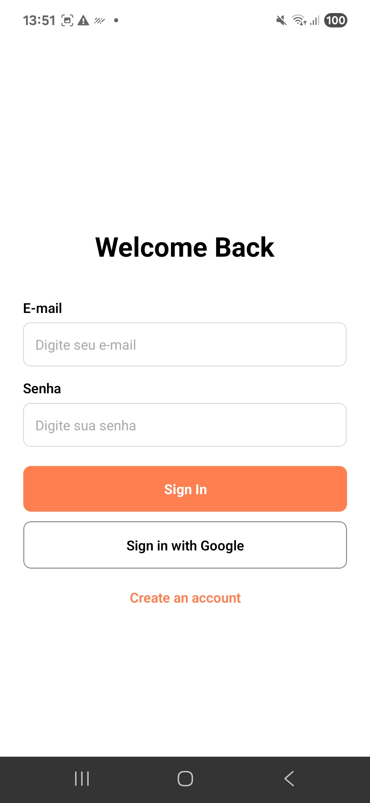
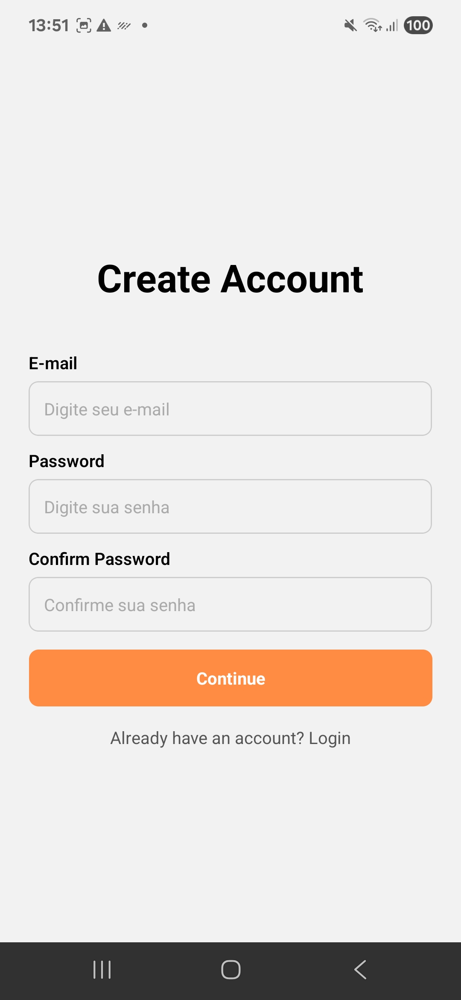
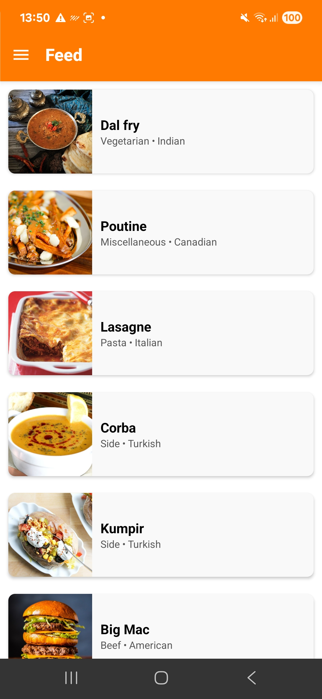
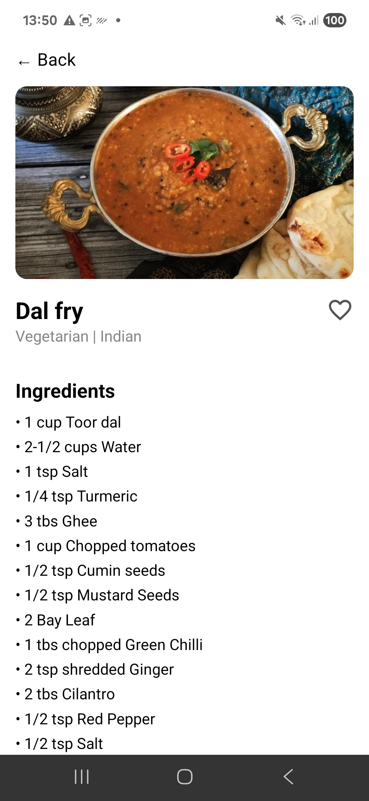
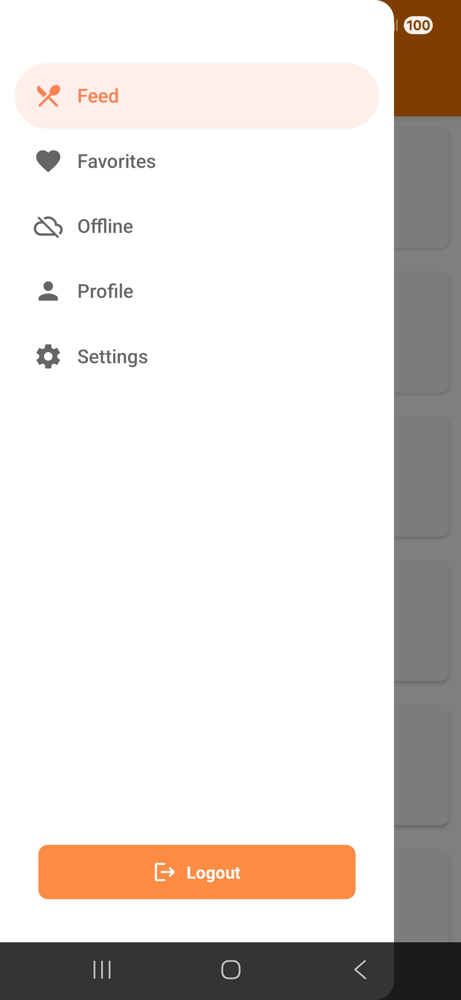

# Chefly - Meal & Recipe App

<!--  -->

Chefly is a mobile application that allows users to track their meals, view recipes, sign in with email/password or Google, and complete their profile.

> The app is built in React Native, fully compatible with both Android and iOS. Currently, testing and builds have been done on Android, and iOS support will be verified and released in a future update.

---

## Features

- Sign up and login with email/password
- Google Sign-In
- View recipes
- Logout
- Drawer navigation with custom menu
- Placeholder for future integrations (e.g., food API)

---

## Screens

| Screen | Description |
|--------|------------|
| **Login** | Login screen with email/password and Google Sign-In button |  |
| **Create Account** | Screen to create an account with password confirmation |  |
| **Home / Dashboard** | Main screen showing meal summary and recipes |  |
| **Recipe Details** | Details of a selected recipe |  |
| **Drawer** | Side menu with navigation and logout button |  |

---

## Technologies

- React Native
- TypeScript
- React Navigation (Stack + Drawer)
- Firebase Auth (Email/Password + Google)
- React Native Vector Icons (MaterialIcons / FontAwesome)

---

## Getting Started

> **Note**: Make sure you have completed the [Set Up Your Environment](https://reactnative.dev/docs/environment-setup) guide before proceeding.

### Step 1: Start Metro

First, run **Metro**, the JavaScript build tool for React Native:

```bash
# Using npm
npm start

# OR using Yarn
yarn start
```

### Step 2: Run the App

Open a new terminal window from the root of your project:

#### Android

```bash
# Using npm
npm run android

# OR using Yarn
yarn android
```

#### iOS (future support)

```bash
# Using npm
npm run ios

# OR using Yarn
yarn ios
```

> Note: iOS support requires Xcode and CocoaPods. Currently, testing is only on Android.

### Step 3: Firebase Setup

- Create a project in Firebase Console
- Enable Email/Password and Google Sign-In
- Download \`google-services.json\` and place it in \`android/app/\`

### Step 4: Release APK Build (Android)

To generate a release APK:

```bash
cd android
gradlew assembleRelease
```

The APK will be located at:

```
android/app/build/outputs/apk/release/app-release.apk
```

> Note: This APK is not signed. To publish on Google Play, you need to create a keystore and configure it in \`build.gradle\`.
